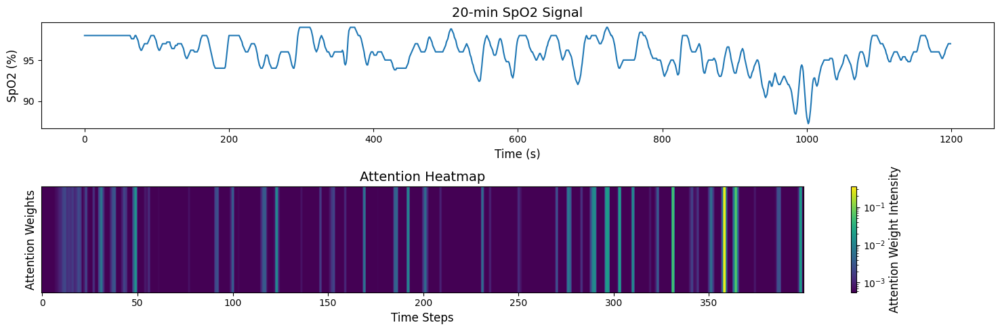

---

# Pediatric-Sleep-Apnea-SpO₂-Analysis

This repository provides tools for preprocessing SpO₂ signals, organizing data for cross-validation, and evaluating deep learning models for assessing pediatric sleep apnea severity. The **SpO₂_Preprocessing_CHAT** notebook automates data downloads and structuring, while **ResNet_CNNBiLSTMAttention.ipynb** facilitates model training and evaluation. Below are setup instructions, usage details, and file structure guidelines.

---

## Table of Contents

1. [Introduction](#introduction)  
2. [File and Directory Structure](#file-and-directory-structure)  
3. [Setup and Installation](#setup-and-installation)  
4. [Usage](#usage)  
   - [Data Preprocessing](#data-preprocessing)  
   - [Cross-Validation Preparation](#cross-validation-preparation)  
   - [Model Training and Evaluation](#model-training-and-evaluation)  
5. [Additional Notes](#additional-notes)  

---

### Introduction

This repository supports the research publication ["Deep learning-enabled analysis of overnight peripheral oxygen saturation signals for pediatric obstructive sleep apnea severity assessment"](https://doi.org/10.1038/s41598-024-67729-9). It enables deep learning model evaluation for assessing pediatric sleep apnea severity using SpO₂ signals. The **SpO₂_Preprocessing_CHAT** notebook handles data extraction, event detection, and segmentation, while **ResNet_CNNBiLSTMAttention** evaluates ResNet and CNN-BiGRU-Attention models.

---

### File and Directory Structure

**Required files and directories before running the notebooks**:

1. **Demographic and Polysomnographic Information Files**:  
   - `chat-baseline-dataset-0.12.0.csv`  
   - `chat-followup-dataset-0.12.0.csv`  

2. **XML Folder** (in `./CHAT_dataset/XML`):  
   - Stores XML annotation files for apnea and oxygen desaturation events:  
   ```plaintext
   XML/
   ├── baseline/    # Baseline group XML files
   └── followup/    # Follow-up group XML files
   ```

3. **CSV Folder** (created in Google Drive or `./CHAT_dataset/CSV`):  
   - Saves apnea and desaturation event details in CSV format:  
   ```plaintext
   CSV/
   ├── ap_ends/     # Apnea event end times
   ├── od_nadirs/   # Oxygen desaturation nadir times
   └── od_starts/   # Oxygen desaturation start times
   ```

4. **Processed Data Folder**:  
   - Stores numpy arrays with preprocessed data:  
   ```plaintext
   processed_data/
   ├── AHIs.npy      # AHI values per signal
   ├── IDs.npy       # Subject IDs
   └── data.npy      # 20-minute SpO₂ segments with indexing
   ```
   - Each row in `data.npy` contains a 20-minute segment of a subject’s SpO₂ signal along with the subject index.  
   - Note: Subject IDs may appear in both baseline and follow-up groups if the subject participated in both studies, but each occurrence will have a unique subject index to track individual segments accurately.

5. **Folds Folder**:  
   - Contains preprocessed data used in this publication, organized for 3-fold cross-validation. You can download a zip file of this folder [here](https://drive.google.com/file/d/1xhFdQ8rZ2J5bxgW8FO3mt16NJWxNZHE-/view?usp=sharing).  
   - Each fold contains training, validation, and test data arrays for evaluation:  
   ```plaintext
   Folds/
   ├── fold_1/
   │   ├── OCM_testAHI1.npy 
   │   ├── OCM_testArray1.npy 
   │   ├── OCM_testIDs1.npy 
   │   ├── OCM_trainAHI1.npy 
   │   ├── OCM_trainArray1.npy 
   │   ├── OCM_trainIDs1.npy 
   │   ├── OCM_valAHI1.npy 
   │   ├── OCM_valArray1.npy 
   │   └── OCM_valIDs1.npy
   ├── fold_2/ (similar structure)
   └── fold_3/ (similar structure)
   ```

6. **Models Folder**:  
   - Contains pretrained weights for each fold:  
   ```plaintext
      Models/
      ├── TensorFlow/
      │   ├── attention_model_fold_1_weights.h5
      │   ├── attention_model_fold_2_weights.h5
      │   ├── attention_model_fold_3_weights.h5
      │   ├── resnet_model_fold_1_weights.h5
      │   ├── resnet_model_fold_2_weights.h5
      │   └── resnet_model_fold_3_weights.h5
      └── PyTorch/
          └── attention_model_pytorch_fold_2.pth     # PyTorch weights for attention extraction
   ```

---

### Setup and Installation

1. Open a new notebook in Google Colab.  
2. Clone the repository:  
   ```bash
   git clone https://github.com/erfan-mtzv/Pediatric-Sleep-Apnea-SpO2-Analysis.git
   ```
3. Move .ipynb files to your Drive:  
   ```bash
   !mkdir -p /content/drive/MyDrive/project/
   !cp -r /content/Pediatric-Sleep-Apnea-SpO2-Analysis/* /content/drive/MyDrive/project/
   ```
4. Open each notebook you need with Google Colaboratory.  
5. Ensure directory paths in notebooks are updated to correctly reference all files.

---

### Usage

#### 1. Data Preprocessing

**SpO₂_Preprocessing_CHAT Notebook**:

- Open `SpO₂_Preprocessing_CHAT.ipynb` in Google Colab.  
- Set the **webpage number** (1-5) and **dataset group** (baseline or followup).  
- Execute cells to download `.edf` files, detect apnea/desaturation events, and save processed data in `.npy` format in Google Drive:  
  - **AHI arrays**: Apnea-Hypopnea Index values per signal.  
  - **ID arrays**: Subject IDs.  
  - **Data arrays**: 20-minute segmented SpO₂ signals.  

#### 2. Cross-Validation Preparation

- After preprocessing all pages for both groups, upload processed data for cross-validation.  
- Merge `.npy` arrays into structured files for n-fold cross-validation in the **Folds** folder.  

#### 3. Model Training and Evaluation

The `ResNet_CNNBiLSTMAttention.ipynb` notebook includes:

- **ResNet** for feature extraction (TensorFlow).  
- **CNN-BiGRU-Attention** for interpretability (TensorFlow and PyTorch).  

Steps:

1. **Load Pretrained Weights**:  
   - Upload pretrained weights from `./Models` for each fold.  
   
2. **Evaluate Model Performance**:  
   - Run evaluations on cross-validation data with metrics like 4-class accuracy, RMSE, and R².  
   
3. **Attention Score Visualization**:  
   - Load `.pth` weights for CNN-BiGRU-Attention in PyTorch.  
   - Extract and plot attention scores to observe model focus on SpO₂ signal features.  

---

### Additional Notes

- Carefully follow the table of contents and comments in the notebooks for effective usage.  
- **Interpretability**: Attention visualizations offer insights into model focus on SpO₂ signal features.  



This repository is a complete toolkit for processing SpO₂ data and evaluating deep learning models for pediatric sleep apnea research with interpretable model output.

---

## PSG Variables from the CHAT Dataset for Validating the Labeling Process

The following table summarizes key polysomnographic (PSG) variables related to sleep stages and apnea events from the CHAT dataset:

| **Category**         | **Variable** | **Description**                                                                                 |
|---------------------|--------------|-------------------------------------------------------------------------------------------------|
| **Obstructive Apneas** | oanbp3       | Total number of obstructive apneas in NREM (supine), ≥ 3% desaturation, with/without arousal.    |
|                     | oanop3       | Total number of obstructive apneas in NREM (non-supine), ≥ 3% desaturation, with/without arousal.|
|                     | oarbp3       | Total number of obstructive apneas in REM (supine), ≥ 3% desaturation, with/without arousal.     |
|                     | oarop3       | Total number of obstructive apneas in REM (non-supine), ≥ 3% desaturation, with/without arousal. |
| **Hypopneas**        | hnrbp3       | Total number of hypopneas in NREM (supine), > 50% flow reduction, ≥ 3% desaturation, with/without arousal. |
|                     | hnrop3       | Total number of hypopneas in NREM (non-supine), > 50% flow reduction, ≥ 3% desaturation.         |
|                     | hrembp3      | Total number of hypopneas in REM (supine), > 50% flow reduction, ≥ 3% desaturation.              |
|                     | hrop3        | Total number of hypopneas in REM (non-supine), > 50% flow reduction, ≥ 3% desaturation.          |
| **Central Apneas**   | carbp3       | Total number of central apneas in REM (supine), ≥ 3% desaturation, with/without arousal.        |
|                     | carop3       | Total number of central apneas in REM (non-supine), ≥ 3% desaturation, with/without arousal.    |
|                     | canbp3       | Total number of central apneas in NREM (supine), ≥ 3% desaturation, with/without arousal.       |
|                     | canop3       | Total number of central apneas in NREM (non-supine), ≥ 3% desaturation, with/without arousal.   |
| **Mixed Apneas**     | marbp3       | Total number of mixed apneas in REM (supine), ≥ 3% desaturation, with/without arousal.         |
|                     | marop3       | Total number of mixed apneas in REM (non-supine), ≥ 3% desaturation, with/without arousal.     |
|                     | manrbp3      | Total number of mixed apneas in NREM (supine), ≥ 3% desaturation, with/without arousal.        |
|                     | manrop3      | Total number of mixed apneas in NREM (non-supine), ≥ 3% desaturation, with/without arousal.    |

---

**Repository Description**:  
Repository for ["Deep learning-enabled analysis of overnight peripheral oxygen saturation signals for pediatric obstructive sleep apnea severity assessment"](https://doi.org/10.1038/s41598-024-67729-9). It includes data preprocessing, segmentation, and deep learning model evaluation pipelines for SpO₂-based pediatric OSA severity assessment.
